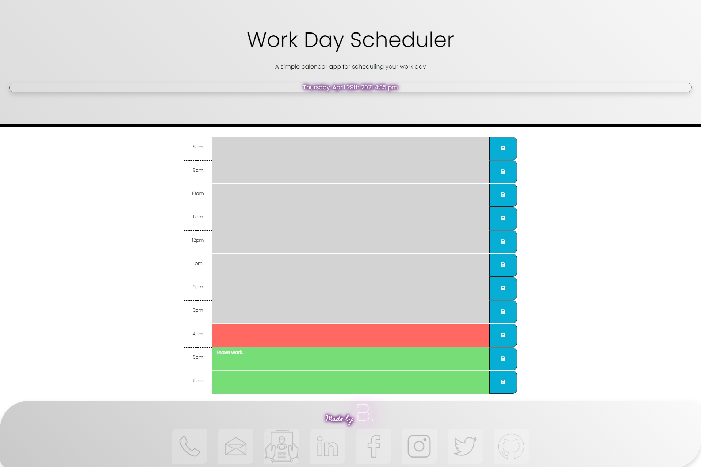

# Work Day Scheduler

### This Github repository contains the code for a work day scheduler, allowing a user to schedule tasks, events and appointments across the hours of the typical working day.

### The work day scheduler displays the information saved by the user, allowing them to return to the website throughout the day to view, manage and update their schedule as required.

---

## Motivation & Research

I was motivated to develop this website to serve as a resource to aid with the management and scheduling of organisational tasks, while also allowing me to apply my developing JavaScript and jQuery language skills, and my knowledge of web APIs alongside implementing a CSS framework.

##  Development
### Web development technologies 
In developing this website I used a combination of HTML, CSS and a CSS framework, Google Fonts, FontAwesome Icons, JavaScript, jQuery and web APIs. Technologies include:

* CSS Framework :
    * Bootstrap https://getbootstrap.com/
* Google Fonts :
    * https://fonts.google.com/
* Font Awesome Icons :
    * https://fontawesome.com/icons?d=gallery&p=2
* JavaScript & jQuery
    * With a particular focus on localStorage functions
* Web APIs :
    * MomentJS : https://momentjs.com/
    * Web Storage : https://developer.mozilla.org/en-US/docs/Web/API/Web_Storage_API

### Graphic design and branding
The initial design and framework of the website was provided from a prexisting style sheet template, combined with the Bootstrap framework. To make the project unique and to better align the site with my personal brand I performed further customisations of the CSS styling, creating a cohesive brand across my application portfolio. Customisations included the use of of keyframe animations, customised fonts and the addition of an on-brand footer with links to contact information, including my Github profile and a download link of my current resume.

### Challenges 

The development of this application required the use of the MomentJS and Web Storage APIs, both new areas of study within my web development career.
In using the MomentJS library, I was able to aquire new knowledge and understanding of parsing, validating, manipulating and displaying date & time in JavaScript.
The successful implementation of the Web Storage API assisted me in gaining a much greater understanding of browser based local storage use cases allowing my application to accept and store user input for use at a later time.
Application of the aquired development skills allowed for successful implementation of local storage functionality within a time sensitive browser based application.

## Future development opportunities

I aim to continue to develop this website to include:
* An enhanced design, refining and improving the layout and asthetics to enhance user experience.
* Resposive web design to allow the application to function optimally across multiple devices and screen sizes.
* User refinable time inputs, allowing for the greater flexibility to book appointments or events in shorter time segments - eg meeting from 0930-1030 or 1145-1200.
* Time zone awareness within the application, allowing users to adjust timezones for their events, to better cater to meetings or events that occur across multiple time zones.
* Alerts and reminder functionality to notify the user about upcoming events or appointments they have previously booked within the application.

**Thank you for visiting.**

### Repository Link:

* https://github.com/blmccavanagh/Work-Day-Scheduler

### Deployed Application Link:

* https://blmccavanagh.github.io/Work-Day-Scheduler/

### Application Screenshots:

---

*Desktop Browser View* 

---

*Work Day Scheduler Demo*

---